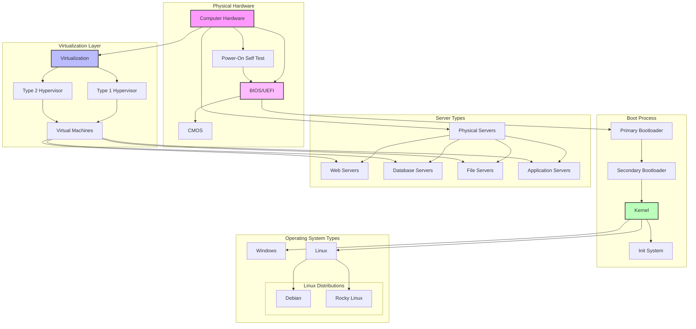

<a href="https://git.io/typing-svg"></a>

---

# FAQ

Essential questions and answers that arose during the Born2beRoot project development and implementation. This section aims to address common queries and provide helpful insights for project execution.

---

# Table of Contents

## 📚 General Knowledge

- [What Happens When You Turn On Your PC?](#what-happens-when-you-turn-on-your-pc-and-is-it-the-same-for-a-virtual-machine)
  - [Power-On Self-Test (POST)](#1-power-on-self-test-post)
  - [UEFI/BIOS Initialization](#2-uefibios-initialization)
  - [BIOS/UEFI Storage Architecture](#biosuefi-storage-architecture)
  - [CMOS and Its Critical Role](#cmos-and-its-critical-role)
  - [Boot Process Evolution and Bootloader Operation](#3-boot-process-evolution-and-bootloader-operation)
  - [Advanced Security Features](#4-advanced-security-features)
  - [Firmware Management](#5-firmware-management)

## 🖥️ Virtualization

- [Understanding Virtualization](#understanding-virtualization)
  - [Core Concepts](#1-core-concepts)
  - [Key Benefits](#2-key-benefits)
  - [Virtualization Technologies](#3-virtualization-technologies)
  
- [Understanding Hypervisors](#understanding-hypervisors)
  - [Types of Hypervisors](#1-types-of-hypervisors)
  - [Core Functions](#2-core-functions)
  - [Advanced Features](#3-advanced-features)
  - [Hypervisor Architecture](#4-hypervisor-architecture)
  - [Performance Considerations](#5-performance-considerations)
  - [Security Features](#6-security-features)

- [Virtual Machine Boot Process](#virtual-machine-boot-process)

## 🖧 Servers

- [Understanding Servers](#understanding-servers)
  - [Types of Servers](#1-types-of-servers)
  - [Server Architecture](#2-server-architecture)
  - [Server Roles](#3-server-roles)
  - [Server Management](#4-server-management)
  - [Server Security](#5-server-security)
  - [High Availability and Scaling](#6-high-availability-and-scaling)
  - [Server Environments](#7-server-environments)

## 🐧 Linux Distributions

- [Understanding Linux Distributions: Debian vs Rocky Linux](#understanding-linux-distributions-debian-vs-rocky-linux)
  - [Debian Overview](#1-debian-overview)
  - [Rocky Linux Overview](#2-rocky-linux-overview)
  - [Comparison and Use Cases](#3-comparison-and-use-cases)
  - [Decision Factors](#4-decision-factors)
  - [Technical Considerations](#5-technical-considerations)
  - [Migration and Support](#6-migration-and-support)

## 📊 Summary

- [System Architecture Diagram](#system-architecture-diagram)
- [Components Description](#components-description)
  - [Boot Process](#boot-process)
  - [Operating Systems](#operating-systems)
  - [Virtualization](#virtualization)
  - [Server Types](#server-types)
  - [Color Legend](#color-legend)
  
## 🛠️ Setting Up

- [Initial Setup](#initial-setup)
  - [Virtual Machine Creation](#virtual-machine-creation)
  - [ISO Installation](#iso-installation)

- [Disk Partitioning](#disk-partitioning)
  - [Primary Partition](#primary-partition)
  - [Encrypted Partition Setup](#encrypted-partition-setup)
  - [File Systems](#file-systems)

- [System Installation](#system-installation)
  - [Mirror Selection](#mirror-selection)
  - [Software Configuration](#software-configuration)

- [Key Concepts](#key-concepts)
  - [ISO Files](#iso-files)
  - [LVM](#lvm-logical-volume-management)
  - [Mount Points](#mount-points)
  - [System Reserved Space](#system-reserved-space-5)
  - [File Structure](#file-structure)
  - [Archive Mirrors](#archive-mirrors)

## 💻 Configuration

- [Key Concepts](#key-concepts-1)
  - [User Management Commands](#user-management-commands)
  - [System Updates](#system-updates)
  - [SSH Installation](#ssh-installation)
  - [Service States](#service-states)

- [Configuration Steps](#configuration-steps)
  - [Initial Setup](#initial-setup-1)
  - [SSH Configuration](#ssh-configuration)
  - [UFW Setup](#ufw-setup)
  - [Hostname Configuration](#hostname-configuration)
  - [User Group Setup](#user-group-setup)
  - [Password Policy Configuration](#password-policy-configuration)
  - [Sudo Configuration](#sudo-configuration)
  - [Monitoring Script Setup](#monitoring-script-setup)

## ⭐ Bonus

### Web Server Setup

- [Lighttpd Installation and Configuration](#lighttpd-installation-and-configuration)
  - [Basic Setup](#basic-setup)
  - [PHP Configuration](#php-configuration)
  - [FastCGI Setup](#fastcgi-setup)

### Database Configuration

- [MariaDB Setup](#mariadb-setup)
  - [Initial Security Configuration](#initial-security-configuration)
  - [Database Creation](#database-creation)
  - [User Management](#user-management)

### WordPress Installation

- [WordPress Setup](#wordpress-setup)
  - [File Configuration](#file-configuration)
  - [Database Integration](#database-integration)
  - [Permission Management](#permission-management)

### Service of choice

- [ClamAV Configuration](#clamav-configuration)
  - [Installation](#installation)
  - [Daemon Setup](#daemon-setup)
  - [Scan Configuration](#scan-configuration)
  - [Automated Scanning](#automated-scanning)

---

📚 

---

## What Happens When You Turn On Your PC, and Is It the Same for a Virtual Machine?

When you turn on a PC, a complex sequence of events occurs as the system initializes. This guide provides a detailed breakdown of the process, incorporating modern technologies and security considerations.

---

### **1. Power-On Self-Test (POST)**

The POST is the first diagnostic process initiated when you power on the computer, performed by the system's BIOS or UEFI firmware.

#### **Purpose and Function:**

- **Primary Role:** Validates critical hardware functionality before OS loading
- **Execution Time:** Typically takes 5-30 seconds depending on hardware configuration
- **Error Handling:** Uses visual displays or beep codes to communicate issues

#### **Component Verification:**

- **CPU:**
  - Validates processor functionality
  - Checks clock speeds and cache
  - Verifies thermal management systems
- **RAM:**
  - Performs memory presence detection
  - Validates memory timing and stability
  - Checks for bad memory sectors
- **Storage Devices:**
  - Identifies connected storage devices
  - Verifies drive controller functionality
  - Checks NVMe, SATA, or IDE interfaces
- **Graphics:**
  - Initializes display adapter
  - Checks video memory
  - Validates display output capabilities
- **Peripherals:**
  - Tests USB controllers
  - Validates keyboard and mouse functionality
  - Checks network interfaces
- **System Management:**
  - Monitors power supply status
  - Checks fan operation
  - Verifies temperature sensors

---

### **2. UEFI/BIOS Initialization**

Once the POST is complete, the BIOS or UEFI comes into play.
Modern systems predominantly use UEFI, though understanding traditional BIOS features remains important for maintaining older systems and understanding PC architecture evolution.

#### **Traditional BIOS Features:**

1. **Basic Configuration:**
   - **Clock Settings:**
     - Real-time clock adjustment
     - Date and time configuration
     - Time zone settings
   - **Boot Configuration:**
     - Boot device priority
     - Quick boot options
     - Boot failure handling

2. **Hardware Management:**
   - **CPU Settings:**
     - Clock speed control
     - Cache management
     - Core enabling/disabling
   - **Memory Settings:**
     - Memory timing configuration
     - Memory frequency adjustment
     - Memory testing options
   - **PCI Configuration:**
     - IRQ assignments
     - I/O port configuration
     - PCI slot control

3. **Power Management:**
   - **ACPI Settings:**
     - Sleep states configuration
     - Power button behavior
     - Wake-on events
   - **APM Features:**
     - Legacy power management
     - Standby mode settings
     - Resume by alarm

4. **Integrated Peripherals:**
   - **Storage Controllers:**
     - IDE configuration
     - SATA operation modes
     - Floppy controller settings
   - **I/O Ports:**
     - Serial port setup
     - Parallel port modes
     - USB configuration
   - **Audio & Network:**
     - Onboard audio control
     - Network boot ROM
     - MAC address display

5. **Security Features:**
   - **Password Protection:**
     - Supervisor password
     - User password
     - Hard disk password
   - **Anti-Virus:**
     - Boot sector protection
     - Virus warning
   - **System Security:**
     - CPU feature control
     - System guard
     - chassis intrusion detection

6. **Monitoring Features:**
   - **Hardware Monitor:**
     - CPU temperature
     - System fan speeds
     - Voltage readings
   - **Smart Fan Control:**
     - Fan speed thresholds
     - Temperature triggers
     - Quiet mode settings

7. **Legacy Support:**
   - **Boot Options:**
     - Legacy USB support
     - CSM (Compatibility Support Module)
     - OS type selection
   - **Device Emulation:**
     - Legacy diskette emulation
     - Legacy keyboard support
     - Legacy video support

#### **Advanced UEFI Features:**

1. **Enhanced Security:**
   - Secure Boot validation
   - TPM (Trusted Platform Module) integration
   - Hardware root of trust
   - Measured boot process

2. **Modern Interface:**
   - GUI-based configuration
   - Mouse support
   - Remote management capabilities
   - Network boot options

3. **Advanced Configurations:**
   - **Power Management:**
     - C-State control
     - P-State management
     - Fan curve customization
   - **Memory:**
     - XMP profiles
     - Memory timing control
     - ECC support
   - **Storage:**
     - NVMe configuration
     - RAID setup
     - Storage encryption options

---

### **BIOS/UEFI Storage Architecture**

Understanding where and how BIOS/UEFI is stored.

#### **1. Physical Storage Location:**

- **Traditional BIOS:**
  - ROM (Read-Only Memory) chip
  - EPROM (Erasable Programmable ROM)
  - EEPROM (Electrically Erasable PROM)
  - Flash ROM (most common in later BIOS systems)

- **Modern UEFI:**
  - SPI Flash memory
  - NOR Flash devices
  - Redundant storage areas
  - Protected storage regions

#### **2. Storage Characteristics:**

- **Capacity:**
  - BIOS: 256KB to 4MB
  - UEFI: 4MB to 32MB typical
  - Multiple firmware volumes
  - Separate configuration storage

- **Access Methods:**
  - Memory-mapped access
  - I/O port access
  - SPI protocol communication
  - Protected mode access

#### **3. Security Features:**

- **Write Protection:**
  - Hardware write protection
  - Software write protection
  - Boot block protection
  - Sector-level locking

- **Integrity Measures:**
  - Checksum verification
  - Digital signatures
  - Secure boot keys
  - Recovery images

#### **4. Update Mechanism:**

- **Flashing Process:**
  - Vendor-specific tools
  - Emergency recovery options
  - Dual BIOS support
  - Update verification

- **Safety Features:**
  - Power loss protection
  - Rollback prevention
  - Version control
  - Backup creation

#### **5. Storage Organization:**

- **Memory Map:**
  - Boot block region
  - Main firmware region
  - Configuration data
  - Management engine firmware
  - Platform data

- **Component Integration:**
  - Microcode updates
  - Option ROMs
  - RAID firmware
  - Network boot code

#### **6. Advanced Features:**

- **Redundancy:**
  - Backup firmware copy
  - Recovery mechanisms
  - Automatic failover
  - Error correction

- **Management:**
  - Remote update capability
  - Health monitoring
  - Logging functions
  - Configuration management

---

### **CMOS and Its Critical Role**

The CMOS (Complementary Metal-Oxide-Semiconductor) plays a vital role in maintaining system configuration persistence. Understanding its functions and maintenance is crucial for system stability.

#### **1. CMOS Architecture:**

- **Physical Structure:**
  - Silicon-based integrated circuit
  - Low power consumption design
  - Typically located near the BIOS chip
  - Contains real-time clock (RTC) circuit

- **Memory Organization:**
  - 128 or 256 bytes of storage
  - Checksum verification
  - Non-volatile storage areas
  - Protected register sections

#### **2. Stored Information:**

- **System Configuration:**
  - Boot sequence settings
  - Drive configurations
  - Memory timings
  - CPU settings
  - Power management options

- **Hardware Settings:**
  - Port configurations
  - Integrated peripheral states
  - Memory cache settings
  - System passwords
  - Fan control parameters

#### **3. Power Management:**

- **Battery Specifications:**
  - CR2032 3V lithium battery
  - Expected lifespan: 5-10 years
  - Temperature-dependent longevity
  - Voltage monitoring capability

- **Power Backup:**
  - Maintains settings during power off
  - Supports RTC operation
  - Provides stable voltage reference
  - Enables quick boot capability

#### **4. Troubleshooting and Maintenance:**

- **Common Issues:**
  - Clock reset symptoms
  - Configuration loss
  - Boot failures
  - Checksum errors
  - Strange hardware behavior

- **Resolution Methods:**
  - Battery replacement procedure
  - CMOS reset techniques
  - Jumper configuration
  - Software reset options

#### **5. Modern Implementations:**

- **Evolution:**
  - Integration with UEFI systems
  - Enhanced security features
  - Expanded storage capacity
  - Improved reliability

- **Advanced Features:**
  - Automatic configuration backup
  - Error logging capabilities
  - Remote management support
  - Configuration profiles

---

## **3. Boot Process Evolution and Bootloader Operation**

### **Complete Boot Sequence:**

1. **Power On & POST**
2. **BIOS/UEFI Initialization**
3. **Bootloader Stage 1 (Primary Bootloader)**
4. **Bootloader Stage 2 (Secondary Bootloader)**
5. **Kernel Loading**
6. **Init System Startup**

### **Bootloader Details:**

#### **1. Primary Bootloader (Stage 1):**

- **Location:** First sector of boot device (MBR/GPT)
- **Size:** 512 bytes for MBR
- **Function:**
  - Loads Stage 2 bootloader
  - Basic hardware initialization
  - Locates boot partition
  - Handles basic error checking

#### **2. Secondary Bootloader (Stage 2):**

- **Common Bootloaders:**
  - **GRUB2 (Grand Unified Bootloader):**
    - Default for most Linux distributions
    - Configuration: `/boot/grub/grub.cfg`
    - Modules: `/boot/grub/i386-pc/`
    - Supports multiple file systems
    - Can boot from network

  - **ISOLINUX:**
    - Used for booting from CD/DVD
    - Part of SYSLINUX project
    - Handles ISO 9660 filesystems
    - Used in live systems

  - **Windows Boot Manager:**
    - Windows systems bootloader
    - Stores in BCD (Boot Configuration Data)
    - Manages Windows boot entries
    - Handles Windows recovery

#### **3. Bootloader Functions:**

- **Core Operations:**
  - Loads kernel into memory
  - Passes boot parameters
  - Initializes early drivers
  - Sets up initial ramdisk (initrd/initramfs)
  - Handles boot menu display

- **Advanced Features:**
  - Memory management
  - File system drivers
  - Kernel parameter editing
  - Boot entry management
  - Security verification

### **4. Boot Process Stages:**

#### **Stage 1 - Initial Boot:**

```
Power On → POST → BIOS/UEFI → MBR/GPT Read → Stage 1 Loader
```

- Reads first sector of boot device
- Locates active partition
- Loads Stage 2 bootloader

#### **Stage 2 - Bootloader Operation:**

```
Stage 2 Load → Config Read → Menu Display → Kernel Selection
```

- Loads bootloader configuration
- Shows boot menu if configured
- Processes boot parameters
- Prepares for kernel load

### **Understanding the Kernel**

Before diving into kernel initialization, it's important to understand what a kernel is:

The kernel is the fundamental core of an operating system that manages hardware resources, provides essential services to system processes, and handles communication between hardware and software components. It's the first program loaded after the bootloader and remains in memory throughout the system's operation.

#### **Core Functions:**

- **Hardware Management:**
  - CPU scheduling and management
  - Memory management and allocation
  - Device driver management
  - I/O operations control
  - Interrupt handling

- **Process Management:**
  - Process creation and termination
  - Process scheduling
  - Inter-process communication
  - Thread management
  - System call handling

#### **Types of Kernels:**

- **Monolithic Kernels:**
  - All services run in kernel space
  - Example: Linux kernel
  - Higher performance
  - Larger memory footprint

- **Microkernel:**
  - Minimal kernel functions
  - Services run in user space
  - Example: MINIX
  - More stable but slower

- **Hybrid Kernels:**
  - Combines both approaches
  - Example: Windows NT kernel
  - Balance of performance and modularity
  - Selective kernel space services

#### **Stage 3 - Kernel Initialization:**

```
Kernel Load → initrd Load → Root FS Mount → Init Start
```

- Loads selected kernel
- Mounts initial ramdisk
- Switches to root filesystem
- Starts init system

### **5. Boot Configuration:**

#### **GRUB2 Configuration:**

```bash
# Main configuration file
/boot/grub/grub.cfg

# User custom entries
/etc/grub.d/

# Default settings
/etc/default/grub
```

#### **Important Parameters:**

- **Kernel Parameters:**

  ```
  root=/dev/sda1    # Root filesystem location
  quiet splash      # Boot display options
  ro               # Read-only root mount
  init=/sbin/init  # Init system path
  ```

- **initrd Options:**
  ```
  initrd /boot/initrd.img-[version]  # Initial ramdisk
  ```

### **6. Multi-Boot Setup:**

#### **Configuration Example:**

```bash
menuentry "Linux" {
    set root=(hd0,1)
    linux /vmlinuz root=/dev/sda1
    initrd /initrd.img
}

menuentry "Windows" {
    set root=(hd0,2)
    chainloader +1
}
```

#### **Boot Management:**

- **OS Detection:**
  - Automatic OS probe
  - Custom entry creation
  - Boot parameter setting
  - Chainloading support

- **Boot Security:**
  - Password protection
  - Secure Boot verification
  - Custom boot scripts
  - Boot entry locking

### **7. Modern Features:**

#### **Fast Boot Implementation:**

- **Hardware State:**
  - Saves device states
  - Skips full POST
  - Maintains hardware config
  - Quick resume capability

- **Optimization:**
  - Parallel device init
  - Driver state preservation
  - Memory state retention
  - Fast path selection

#### **Network Boot:**

- **PXE Process:**
  ```
  DHCP Request → TFTP Boot → Kernel Download → Network Root
  ```

- **Components:**
  - DHCP server configuration
  - TFTP server setup
  - Network bootloader
  - Network filesystem

---

### **4. Advanced Security Features**

#### **Modern Security Implementations:**

1. **Hardware Security:**
   - **TPM Integration:**
     - Encryption key storage
     - Platform integrity verification
     - Secure boot chain validation

   - **Secure Enclave:**
     - Protected credential storage
     - Biometric data handling
     - Encryption acceleration

2. **Boot Security:**
   - **Measured Boot:**
     - Validates boot component integrity
     - Creates audit trail
     - Enables remote attestation

   - **Boot Guard:**
     - Hardware-based root of trust
     - Prevents unauthorized firmware modifications
     - Protects against boot-level malware

The section shows how BIOS, while more limited than UEFI, still provided essential configuration options for:

- Basic system settings
- Hardware management
- Power configurations
- Peripheral device control
- Security features
- System monitoring
- Legacy support

---

### **5. Firmware Management**

#### **Modern Firmware Considerations:**

1. **Update Management:**
   - Automatic firmware updates
   - Rollback protection
   - Update verification

2. **Recovery Features:**
   - Dual BIOS/UEFI
   - Automatic recovery
   - Emergency flash options

3. **Configuration Management:**
   - Profile-based settings
   - Configuration backup
   - Remote management capabilities

---

## **Understanding Virtualization**

Virtualization is a technology that allows the creation of virtual versions of computing resources, enabling multiple virtual environments to run on a single physical hardware system.

### **1. Core Concepts:**

- **Resource Abstraction:**
  - Separation of physical and logical resources
  - Hardware independence
  - Resource pooling
  - Dynamic allocation

- **Types of Virtualization:**
  - **Hardware Virtualization:**
    - Complete machine virtualization
    - CPU, memory, and I/O virtualization
    - Direct hardware access capabilities
  
  - **Software Virtualization:**
    - Application virtualization
    - Operating system virtualization
    - Service virtualization

  - **Network Virtualization:**
    - Virtual networks
    - Network function virtualization
    - Software-defined networking

  - **Storage Virtualization:**
    - Virtual disk systems
    - Storage pools
    - Storage area networks

### **2. Key Benefits:**

- **Resource Optimization:**
  - Improved hardware utilization
  - Consolidated workloads
  - Reduced power consumption
  - Cost efficiency

- **Flexibility:**
  - Rapid deployment
  - Environment isolation
  - Easy backup and recovery
  - Resource scaling

- **Management:**
  - Centralized control
  - Automated operations
  - Simplified maintenance
  - Enhanced security

### **3. Virtualization Technologies:**

- **CPU Virtualization:**
  - Intel VT-x
  - AMD-V
  - Instruction set simulation
  - Hardware acceleration

- **Memory Virtualization:**
  - Page table virtualization
  - Memory ballooning
  - Transparent page sharing
  - NUMA virtualization

- **I/O Virtualization:**
  - Device emulation
  - Direct I/O (passthrough)
  - SR-IOV
  - IOMMU support

## **Understanding Hypervisors**

A hypervisor, also known as a Virtual Machine Monitor (VMM), is software or firmware that creates and manages virtual machines.

### **1. Types of Hypervisors:**

#### **Type 1 (Bare-Metal):**

- **Characteristics:**
  - Runs directly on hardware
  - No host OS required
  - Higher performance
  - Better security

- **Examples:**
  - VMware ESXi
  - Microsoft Hyper-V
  - Citrix XenServer
  - KVM (when integrated into Linux kernel)

#### **Type 2 (Hosted):**

- **Characteristics:**
  - Runs on host operating system
  - Easier to install and manage
  - Lower performance than Type 1
  - More flexible for desktop use

- **Examples:**
  - VMware Workstation
  - Oracle VirtualBox
  - Parallels Desktop
  - Microsoft Virtual PC

### **2. Core Functions:**

- **Resource Management:**
  - CPU scheduling
  - Memory allocation
  - I/O handling
  - Storage management

- **VM Lifecycle Management:**
  - Creation and deletion
  - Start and stop operations
  - Suspend and resume
  - Migration capabilities

- **Security:**
  - VM isolation
  - Resource access control
  - Security policy enforcement
  - Hardware security features

### **3. Advanced Features:**

#### **Resource Optimization:**

- **Memory Management:**
  - Memory overcommitment
  - Page sharing
  - Swap optimization
  - Memory compression

- **CPU Management:**
  - CPU scheduling
  - Load balancing
  - Power management
  - NUMA optimization

#### **High Availability:**

- **Fault Tolerance:**
  - Live migration
  - Automatic failover
  - Resource redundancy
  - Health monitoring

- **Disaster Recovery:**
  - Backup integration
  - Replication
  - Site recovery
  - Point-in-time recovery

### **4. Hypervisor Architecture:**

- **Components:**
  - Virtual CPU manager
  - Memory manager
  - I/O subsystem
  - Resource scheduler
  - Security manager

- **Interfaces:**
  - Management API
  - Guest interfaces
  - Hardware abstraction layer
  - Storage interfaces

### **5. Performance Considerations:**

- **Overhead Management:**
  - Hardware assistance usage
  - Driver optimization
  - Resource contention handling
  - Cache optimization

- **Monitoring:**
  - Performance metrics
  - Resource utilization
  - Bottleneck detection
  - Capacity planning

### **6. Security Features:**

- **Isolation:**
  - VM boundaries
  - Resource isolation
  - Network segregation
  - Storage isolation

- **Access Control:**
  - Role-based access
  - Authentication
  - Authorization
  - Audit logging

---

### **Virtual Machine Boot Process**

The boot process for virtual machines (VMs) differs from physical computers while maintaining similar logical steps. Understanding these differences is crucial for virtualization management.

#### **1. Key Differences from Physical Machines:**

- **Hardware Abstraction:**
  - Virtual hardware instead of physical components
  - Emulated or paravirtualized devices
  - Resource sharing with host system
  - Dynamic resource allocation

- **Boot Sequence Variations:**
  - No physical POST process
  - Simulated BIOS/UEFI environment
  - Host-controlled initialization
  - Faster boot times typically

#### **2. Virtual Machine BIOS/UEFI:**

- **Implementation Types:**
  - **SeaBIOS:** Common in QEMU/KVM
  - **OVMF:** UEFI implementation for VMs
  - **Hyper-V UEFI:** Microsoft's implementation
  - **VMware BIOS/UEFI:** Proprietary implementation

- **Features:**
  - Limited configuration options
  - Simplified device initialization
  - Host-managed settings
  - Standardized interfaces

#### **3. Virtual Hardware Initialization:**

- **Device Emulation:**
  - Virtual CPU allocation
  - Memory mapping
  - Virtual disk controllers
  - Network interface emulation

- **Resource Management:**
  - Memory ballooning
  - CPU scheduling
  - I/O prioritization
  - Storage provisioning

#### **4. VM-Specific Boot Options:**

- **Boot Sources:**
  - Virtual disk images
  - ISO files
  - Network boot (PXE)
  - Direct kernel boot

- **Boot Configurations:**
  - Secure Boot support
  - TPM virtualization
  - Boot order control
  - UEFI/BIOS mode selection

#### **5. Hypervisor Interaction:**

- **Boot Process Control:**
  - VM creation parameters
  - Resource allocation
  - Hardware feature exposure
  - State management

- **Security Features:**
  - Nested virtualization
  - Hardware-assisted virtualization
  - Memory protection
  - I/O MMU virtualization

#### **6. Platform-Specific Considerations:**

##### **VMware:**

- **Features:**
  - EFI/BIOS selection
  - Advanced hardware customization
  - Snapshot integration
  - Hardware version options

- **Boot Options:**
  - Direct console access
  - Boot menu customization
  - Firmware configuration
  - Device mapping

##### **Hyper-V:**

- **Generation Differences:**
  - Generation 1 (BIOS-based)
  - Generation 2 (UEFI-based)
  - Secure Boot support
  - Device compatibility

- **Boot Configuration:**
  - Virtual firmware settings
  - Integration services
  - Boot order control
  - Security options

##### **KVM/QEMU:**

- **BIOS Options:**
  - SeaBIOS configuration
  - OVMF implementation
  - Direct kernel boot
  - Custom firmware support

- **Virtual Hardware:**
  - Device emulation options
  - PCI passthrough
  - VFIO support
  - Machine type selection

#### **7. Performance Considerations:**

- **Optimization Techniques:**
  - Quick Boot enablement
  - Memory page sharing
  - CPU feature exposure
  - I/O optimization

- **Resource Management:**
  - Dynamic resource allocation
  - Memory overcommitment
  - CPU scheduling
  - Storage I/O control
[Previous sections remain the same]

---

## **Understanding Servers**

A server is a computer system or software that provides functionality, resources, or services to other computers, known as clients, over a network.

### **1. Types of Servers:**

#### **Hardware Servers:**

- **Physical Characteristics:**
  - Redundant power supplies
  - Hot-swappable components
  - Error-correcting memory (ECC)
  - RAID storage systems
  - Enterprise-grade processors
  - Rack-mountable chassis

- **Form Factors:**
  - Tower servers
  - Rack servers
  - Blade servers
  - Micro servers
  - Mainframe systems

#### **Software Servers:**

- **Web Servers:**
  - Apache HTTP Server
  - Nginx
  - Microsoft IIS
  - LiteSpeed

- **Database Servers:**
  - MySQL/MariaDB
  - PostgreSQL
  - Microsoft SQL Server
  - Oracle Database
  - MongoDB

- **Application Servers:**
  - Tomcat
  - JBoss/WildFly
  - WebSphere
  - Node.js
  - WebLogic

- **File Servers:**
  - Windows File Server
  - NFS
  - Samba
  - FTP servers

### **2. Server Architecture:**

#### **Hardware Architecture:**

- **Processing:**
  - Multi-core processors
  - Multiple CPU sockets
  - Large cache sizes
  - High-speed interconnects

- **Memory Systems:**
  - ECC RAM
  - Multiple memory channels
  - Large memory capacity
  - Memory hot-swap support

- **Storage Systems:**
  - RAID configurations
  - Hot-swappable drives
  - SAN/NAS connectivity
  - Cache batteries/flash

- **Network Infrastructure:**
  - Multiple NICs
  - Redundant connections
  - High-speed interfaces
  - Management ports

#### **Software Architecture:**

- **Operating Systems:**
  - Windows Server
  - Linux distributions
  - Unix variants
  - VMware ESXi

- **Service Management:**
  - Process monitoring
  - Service discovery
  - Load balancing
  - Failover clustering

### **3. Server Roles:**

#### **Infrastructure Services:**

- **Network Services:**
  - DNS servers
  - DHCP servers
  - Directory services
  - Authentication servers

- **Storage Services:**
  - Backup servers
  - Archive systems
  - Content delivery
  - File sharing

#### **Application Services:**

- **Business Applications:**
  - Email servers
  - Collaboration platforms
  - CRM systems
  - ERP solutions

- **Development Services:**
  - Source control
  - Build servers
  - Testing environments
  - Deployment systems

### **4. Server Management:**

#### **Administration:**

- **Configuration Management:**
  - Server setup
  - Service configuration
  - Policy management
  - Security settings

- **Monitoring:**
  - Performance metrics
  - Resource utilization
  - Error logging
  - Availability monitoring

#### **Maintenance:**

- **Updates and Patches:**
  - Security updates
  - Feature updates
  - Firmware updates
  - Driver updates

- **Backup and Recovery:**
  - Regular backups
  - Disaster recovery
  - System imaging
  - Point-in-time recovery

### **5. Server Security:**

#### **Physical Security:**

- **Access Control:**
  - Restricted areas
  - Surveillance systems
  - Environmental monitoring
  - Physical locks

- **Environmental Protection:**
  - Climate control
  - Fire suppression
  - Power protection
  - Redundant systems

#### **Digital Security:**

- **Network Security:**
  - Firewalls
  - Intrusion detection
  - VPN access
  - Network segmentation

- **System Security:**
  - Access controls
  - Authentication systems
  - Encryption
  - Security policies

### **6. High Availability and Scaling:**

#### **Availability Features:**

- **Redundancy:**
  - Redundant hardware
  - Failover systems
  - Load balancing
  - Geographic distribution

- **Monitoring and Recovery:**
  - Automated failover
  - Health checking
  - Performance monitoring
  - Incident response

#### **Scaling Options:**

- **Vertical Scaling:**
  - CPU upgrades
  - Memory expansion
  - Storage increases
  - Network improvements

- **Horizontal Scaling:**
  - Server clusters
  - Load distribution
  - Geographic distribution
  - Cloud integration

### **7. Server Environments:**

#### **Deployment Options:**

- **On-Premises:**
  - Data centers
  - Server rooms
  - Edge locations
  - Branch offices

- **Cloud Services:**
  - Public cloud
  - Private cloud
  - Hybrid cloud
  - Multi-cloud

#### **Hosting Types:**

- **Dedicated Hosting:**
  - Single-tenant servers
  - Bare metal servers
  - Managed services
  - Colocation

- **Virtual Hosting:**
  - Virtual private servers
  - Cloud instances
  - Container hosts
  - Shared hosting

---

## **Understanding Linux Distributions: Debian vs Rocky Linux**

### **1. Debian Overview:**

#### **Core Characteristics:**

- **Origin and Philosophy:**
  - Founded in 1993
  - Community-driven development
  - Focuses on software freedom
  - Strong commitment to stability
  - Large volunteer developer base

- **Release Cycle:**
  - Stable releases every 2-3 years
  - Long-term support (LTS)
  - Testing and Unstable branches
  - Security updates priority
  - Conservative update policy

#### **Key Features:**

- **Package Management:**
  - APT package manager
  - DEB package format
  - Over 59,000 packages
  - Built-in dependency resolution
  - Multiple repository support

- **Architecture Support:**
  - Multiple architectures
  - ARM support
  - x86/x86_64
  - MIPS
  - PowerPC

### **2. Rocky Linux Overview:**

#### **Core Characteristics:**

- **Origin and Philosophy:**
  - Founded in 2020
  - CentOS replacement
  - Enterprise-focused
  - 1:1 binary compatibility with RHEL
  - Community-driven enterprise distribution

- **Release Cycle:**
  - Follows RHEL release cycle
  - 10-year support lifecycle
  - Regular security updates
  - Predictable updates
  - Enterprise stability focus

#### **Key Features:**

- **Package Management:**
  - DNF package manager
  - RPM package format
  - Enterprise-grade packages
  - Built-in security features
  - RHEL compatibility

- **Architecture Support:**
  - x86_64
  - AArch64
  - Power9
  - Enterprise hardware focus
  - Server optimizations

### **3. Comparison and Use Cases:**

#### **Debian Strengths:**

- **Flexibility:**
  - Multiple desktop environments
  - Various installation options
  - Custom kernel support
  - Diverse package selection
  - Hardware adaptability

- **Use Cases:**
  - Web servers
  - Development environments
  - Desktop systems
  - Educational institutions
  - Small to medium businesses

#### **Rocky Linux Strengths:**

- **Enterprise Focus:**
  - RHEL compatibility
  - Enterprise tools support
  - Commercial software support
  - Hardware certification
  - Enterprise security features

- **Use Cases:**
  - Enterprise servers
  - Mission-critical systems
  - Commercial applications
  - High-performance computing
  - Corporate environments

### **4. Decision Factors:**

#### **Choose Debian When:**

- **Requirements:**
  - Need maximum flexibility
  - Want extensive package selection
  - Prefer community-driven development
  - Need diverse architecture support
  - Want strong desktop support

- **Advantages:**
  - Lower resource requirements
  - More frequent updates
  - Larger package repository
  - Better desktop integration
  - More customization options

#### **Choose Rocky Linux When:**

- **Requirements:**
  - Need RHEL compatibility
  - Want enterprise stability
  - Require long-term support
  - Use enterprise applications
  - Need commercial support options

- **Advantages:**
  - Enterprise-grade stability
  - Longer support cycle
  - Better enterprise tool integration
  - Commercial software compatibility
  - Professional support availability

### **5. Technical Considerations:**

#### **System Administration:**

- **Debian:**
  - APT-based management
  - Debian-specific tools
  - SystemD integration
  - Network configuration
  - Security frameworks

- **Rocky Linux:**
  - DNF/YUM management
  - RHEL-compatible tools
  - SELinux integration
  - Network Manager
  - Enterprise management tools

#### **Security Features:**

- **Debian:**
  - Regular security updates
  - AppArmor by default
  - Security audit tools
  - Package verification
  - Secure boot support

- **Rocky Linux:**
  - SELinux by default
  - RHEL security features
  - Enterprise security tools
  - Compliance tools
  - Security certifications

### **6. Migration and Support:**

#### **Community Support:**

- **Debian:**
  - Large community forums
  - Extensive documentation
  - Many online resources
  - Active mailing lists
  - IRC channels

- **Rocky Linux:**
  - Growing community
  - Enterprise focus
  - Professional support options
  - Documentation project
  - Commercial partnerships

#### **Migration Paths:**

- **To Debian:**
  - From Ubuntu
  - From other Debian derivatives
  - Cross-grade options
  - Custom migration tools

- **To Rocky Linux:**
  - From CentOS
  - From RHEL
  - From other EL distributions
  - Enterprise migration tools

---


## System Architecture Diagram



## Components Description

### Boot Process

1. **POST (Power-On Self-Test)**
   - Initial hardware check
   - Verifies basic system functionality

2. **BIOS/UEFI**
   - Initializes hardware
   - Loads bootloader

3. **Bootloader**
   - Primary (Stage 1) and Secondary (Stage 2) bootloaders
   - Loads the kernel

4. **Kernel**
   - Core of the operating system
   - Manages hardware resources
   - Controls system processes

### Operating Systems

- **Linux Distributions**
  - Debian: Community-driven, stable
  - Rocky: Enterprise-focused, RHEL-compatible

### Virtualization

- **Type 1 Hypervisor** (Bare Metal)
- **Type 2 Hypervisor** (Hosted)
- **Virtual Machines**

### Server Types

- Web Servers
- Database Servers
- File Servers
- Application Servers

## Color Legend

- Pink: Hardware components
- Blue: Virtualization components
- Green: Kernel/OS components
- Purple: Firmware components

---

🛠️ 

## Initial Setup

1. Install VirtualBox
2. Create new VM with manual installation (skip unattended)
3. Configure virtual hard disk: 30.8GB (bonus requirement)
4. Boot Debian ISO, select "Install" (non-GUI)

## Disk Partitioning

Use manual partitioning with MiB/GiB units (accounts for 5% system reservation)

### Primary Partition

- Size: 500 MiB
- Mount: /boot
- Filesystem: ext4

### Encrypted Partition Setup

1. Encrypt remaining disk space
2. Create LVM Group
3. Create Logical Volumes:
   - root
   - swap
   - home
   - var
   - srv
   - tmp
   - var-log

### File Systems

- All volumes except swap: ext4 journaling
- Swap: swap file system

## System Installation

1. Skip additional media scan
2. Select archive mirror: deb.debian.org
3. Software selection: None (minimal install)

## Key Concepts

### ISO Files

- Disk image format containing filesystem
- Used for OS installation media
- ISO 9660 standard format

### LVM (Logical Volume Management)

- Flexible disk management
- Allows dynamic resizing
- Manages storage pools
- Supports snapshots

### Mount Points

- Directory where filesystem accessible
- Hierarchical structure
- Examples:
  - /boot: Boot loader files
  - /: Root filesystem
  - /home: User directories
  - /var: Variable data
  - /tmp: Temporary files

### System Reserved Space (5%)

- Reserved for root user
- Prevents filesystem fragmentation
- Ensures system stability
- Critical for system recovery

### File Structure

#### ext4 Journaling

- Journaling filesystem
- Crash recovery
- Enhanced reliability
- Improved performance

#### Key Directories

- /boot: Kernel and boot files
- /root: System administration
- /home: User data
- /var: Variable data
- /srv: Service data
- /tmp: Temporary files
- /var/log: System logs

### Archive Mirrors

- Repository servers
- Package distribution
- Geographic distribution
- Load balancing

---

💻 

## Key Concepts

### User Management Commands

- `su -`: Full switch to root user (loads complete root environment)
- `su`: Switch to root while keeping current user's environment variables

### System Updates

- `apt update`: Updates package index
- `apt upgrade`: Upgrades installed packages to latest versions

### SSH Installation

- `openssh-server`: Complete SSH server package
- `ssh`: Basic SSH client tools

### Service States

- `enabled`: Service starts automatically on boot
- `active`: Service currently running

## Configuration Steps

### 1. Initial Setup

```bash
su -
apt update
apt upgrade
apt install sudo
adduser <username> sudo
reboot
```

### 2. SSH Configuration

```bash
sudo apt install openssh-server -y
sudo service ssh status
sudo nano /etc/ssh/sshd_config
# Change: Port 22 → 4242
#         PermitRootLogin prohibit-password → no
sudo service ssh restart
sudo service ssh status
```

### 3. UFW Setup

```bash
sudo apt install ufw -y
sudo ufw enable
sudo ufw allow 4242
sudo ufw status
sudo systemctl resrart ufw
```

### 4. Hostname Configuration

```bash
sudo hostnamectl set-hostname <newhostname>
sudo nano /etc/hosts
# Update hostname in DNS config
sudo systemctl restart *
```

### 5. User Group Setup

```bash
sudo addgroup user42
sudo adduser <username> user42
getent group user42
sudo systemctl restart *
```

### 6. Password Policy Configuration

```bash
sudo apt install libpam-pwquality -y
sudo nano /etc/security/pwquality.conf
```

Add/modify these settings:

```
difok = 7
minlen = 10
dcredit = -1
ucredit = -1
lcredit = -1
maxrepeat = 3
usercheck = 1
enforce_for_root
```

Modify `/etc/login.defs`:

```bash
sudo nano /etc/login.defs
# Set: PASS_MAX_DAYS 30
#      PASS_MIN_DAYS 2
```

Apply to existing users:

```bash
sudo chage -M 30 -m 2 root
sudo chage -M 30 -m 2 <username>
```

### 7. Sudo Configuration

```bash
sudo mkdir -p /var/log/sudo
sudo chmod 700 /var/log/sudo
sudo touch /var/log/sudo/sudo.log
sudo visudo
```

Add these settings:

```
Defaults  passwd_tries=3
Defaults  badpass_message="Invalid password!"
Defaults  log_input
Defaults  log_output
Defaults  iolog_dir="/var/log/sudo"
Defaults  logfile="/var/log/sudo/sudo.log"
Defaults  requiretty
```

### 8. Monitoring Script Setup

```bash
sudo touch /usr/local/bin/monitoring.sh
sudo chmod +x /usr/local/bin/monitoring.sh
sudo nano /usr/local/bin/monitoring.sh
```

add the following commands

```bash
#!/bin/bash
wall "
        #Architecture:          $(uname -a)
        #CPU physical:          $(lscpu | grep 'So' | awk '{print $2}')
        #vCPU:                  $(lscpu | grep '^CPU(s)' | awk '{print $2}')
        #Memory Usage:          $(free -m | grep 'M' | awk '{print $3 "/" $2 "MB (" sprintf("%.2f", $3/$2*100) "%)"}')
        #Disk Usage:            $(df -BM | grep 'dev' | grep -v 'boot$' |awk '{total+=2; used+=3} END {print used "/" total/1024 "GB (" int(used/total*100) "%"}')
        #CPU load:              $(top -bn1 | grep 'Cpu' | awk '{print sprintf("%.1f", $3 + $1) "%"}')
        #Last boot:             $(who -b | awk '{print $3, $4}')
        #LVM use:               $(lsblk | grep -q 'lvm' && echo yes || echo no)
        #Connections TCP:       $(ss -tH state ESTABLISHED | wc -l) ESTABLISHED
        #User log:              $(users | sort | uniq | wc -w) ESTABLISHED
        # Network:              IP $(hostname -I) ($(ip link | grep 'ether' | awk '{print $2}'))
        #Sudo:                   $(cat /var/log/sudo/sudo.log | grep 'COMMAND' | wc -l) cmd
"
```

update crontab so it will run monitoring.sh every 10 minutes after reboot

```
sudo crontab -e
# Add: @reboot while true; do sleep 600 && /usr/local/bin/monitoring.sh; done
sudo crontab -l
```

To interrupt the script, first find its process using ps then kill it

```bash
sudo ps aux | grep monitoring.sh
sudo kill <PID>
```

Alternatively you can use pkill

```bash
sudo pkill -f monitoring.sh
```

---

⭐ 

## 1. Initial System Setup

Update package lists and install required packages:

```bash
# Updates the package list to ensure you get the latest versions
sudo apt update

# Installs the required packages:
# lighttpd: A lightweight web server
# mariadb-server: Database server for storing WordPress data
# php-cgi: PHP interpreter for processing PHP files
# php-mysql: PHP extension for MySQL database connectivity
# wget: Tool for downloading files from the internet
# tar: Tool for extracting compressed files
sudo apt install lighttpd mariadb-server php-cgi php-mysql wget tar
```

Check and remove Apache2 if installed (Apache2 can conflict with Lighttpd as both use port 80):

```bash
# Check if Apache2 is running
sudo systemctl status apache2

# Remove Apache2 completely
sudo apt purge apache2

# Remove any remaining dependencies
sudo apt autoremove
```

## 2. Configure Firewall

Set up firewall rules:

```bash
# Allow incoming HTTP traffic (port 80)
sudo ufw allow http

# Check firewall status and rules
sudo ufw status
```

## 3. Configure Lighttpd

Enable PHP support in Lighttpd:

```bash
# Enable FastCGI module for better performance
sudo lighty-enable-mod fastcgi

# Enable PHP support through FastCGI
sudo lighty-enable-mod fastcgi-php

# Reload Lighttpd to apply changes
sudo service lighttpd force-reload
```

## 4. Configure MariaDB

Secure the database server:

```bash
# Run the security script to set up MariaDB securely
sudo mysql_secure_installation
```

Follow these prompts with explanations:

```
Enter current password: Press Enter (none by default)
Switch to unix_socket authentication: Y (More secure authentication method)
Set root password: Y (Creates admin password)
  New password: said
  Re-enter password: said
Remove anonymous users: Y (Improves security)
Disallow root login remotely: Y (Prevents remote root access)
Remove test database: Y (Removes unnecessary test database)
Reload privilege tables: Y (Applies all changes)
```

```bash
# Restart MariaDB to apply all security changes
sudo systemctl restart MariaDB
```

## 5. Create WordPress Database

Access MySQL command line:

```bash
# Log into MySQL as root user with password authentication
mysql -u root -p
```

Set up WordPress database and user:

```sql
# Create a new database for WordPress
CREATE DATABASE schahir_db;

# Create a new user 'schahir' with password 'said' and grant all permissions on the WordPress database
GRANT ALL ON wordpress.* TO 'schahir'@'localhost' IDENTIFIED BY 'said';

# Apply the privilege changes immediately
FLUSH PRIVILEGES;

# Exit MySQL command line
EXIT;
```

## 6. Install WordPress

Download and set up WordPress files:

```bash
# Change to web server directory
cd /var/www/html

# Download latest WordPress
sudo wget http://wordpress.org/latest.tar.gz

# Extract WordPress archive
sudo tar -xzvf latest.tar.gz

# Move WordPress files to current directory
sudo mv wordpress/* .

# Clean up unnecessary files
rm -rf wordpress latest.tar.gz
```

Set correct permissions:

```bash
# Make web server user (www-data) the owner of WordPress files
chown -R www-data:www-data /var/www/html

# Set correct file permissions (755 allows read and execute for everyone, write for owner)
chmod -R 755 /var/www/html
```

Configure WordPress:

```bash
# Create WordPress config file from sample
sudo mv wp-config-sample.php wp-config.php

# Open config file for editing
sudo nano wp-config.php
```

Edit database configuration:

```php
<?php
/* ... */
/** Set database name */
define( 'DB_NAME', 'schahir_db' );
/** Set database username */
define( 'DB_USER', 'schahir' );
/** Set database password */
define( 'DB_PASSWORD', 'said' );
```

```bash
# Restart web server to apply all changes
sudo systemctl restart lighttpd
```

---

## 7. ClamAV-daemon service Installation and Configuration

ClamAV is an open-source antivirus engine for detecting trojans, viruses, malware, and other malicious threats.

Install ClamAV and it's background service:

```bash
# Install ClamAV and its daemon (background service)
sudo apt install clamav clamav-daemon -y
```

Update and start antivirus:

```bash
# Download latest virus definitions
sudo freshclam

# Start the ClamAV daemon
sudo systemctl start clamav-daemon

# Configure ClamAV to start on boot
sudo systemctl enable clamav-daemon

# Check if ClamAV daemon is running properly
sudo systemctl status clamav-daemon

# Perform a full system scan (recursive scan from root directory)
sudo clamscan -r /
```
